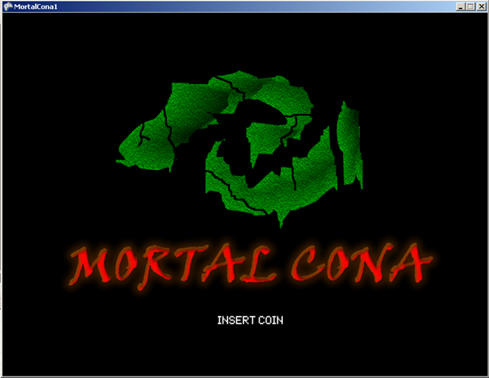
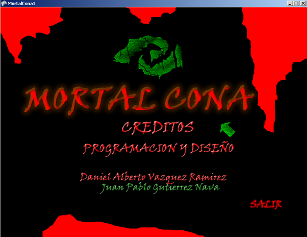
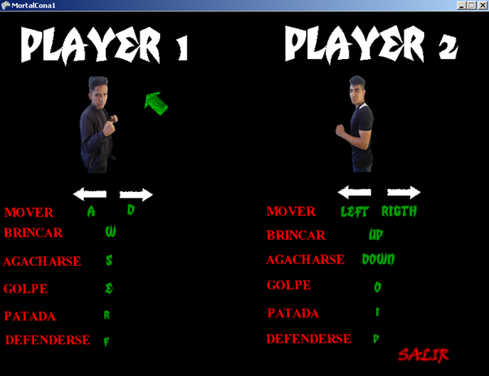
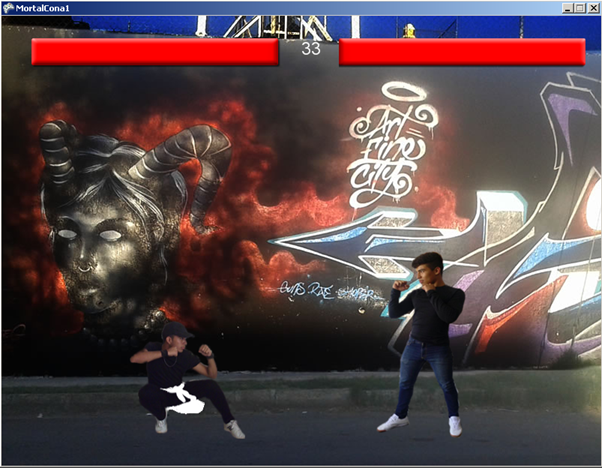
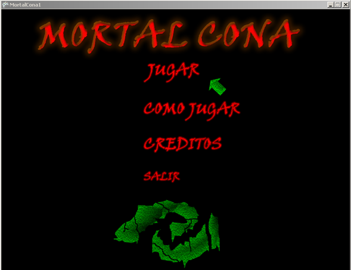
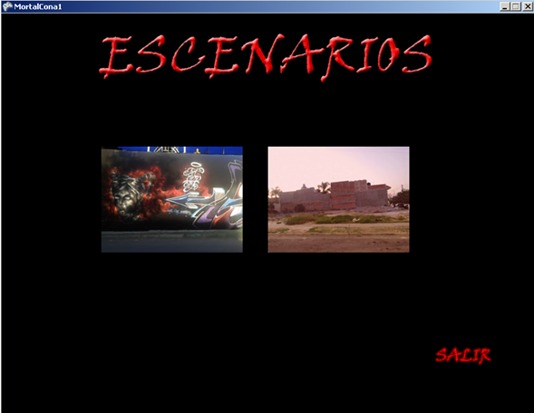
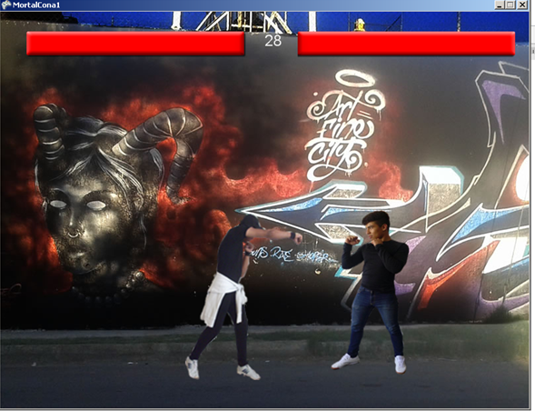
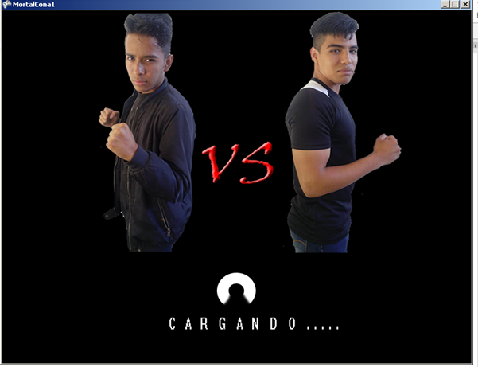
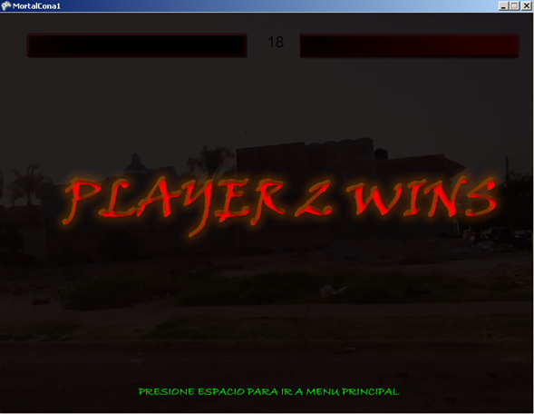

# MortalCona
This game was developed as a final project to simulate a famous fighting game on consoles using the object-oriented programming paradigm. It combines fun and learning.

  
  

  

